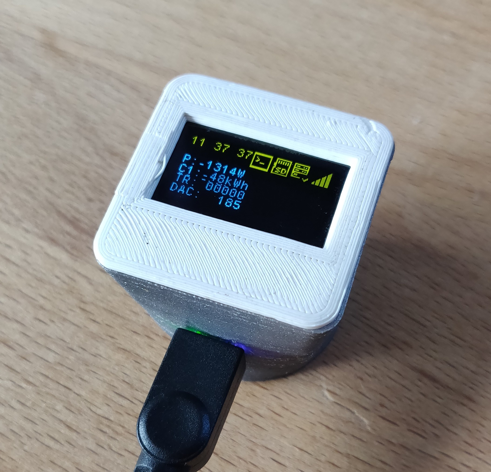

# Smargy IoT Smartmeter Reader

This Project is a continuation of the second version available [here](https://github.com/VinFar/SML_Reader_V2.0).

# Introduction
This Repo is about a IoT Device for reading out the upcoming electrical [SmartMeter](https://discovergy.com/blog/was-ist-ein-smart-meter). With this device it is possible to record and display one's own power consumption in order to optimize it afterwards. 

It is part of an eco-system consisting of the following features:
- This IoT-Device for reading out the Smartmeters ([VinFar](https://github.com/VinFar))
- InfluxDB & Grafana for visualization the data coming from the Readers ([descilla](https://github.com/descilla))
- Prediction of power generation for the next days based on the weather forecast if a photovoltaic plant exists ([descilla](https://github.com/descilla))
- Web-Interface with GUI (PC and Smartphone) for usability ([ChrisWun](https://github.com/ChrisWun))

The IoT-Device (referred as Reader) is briefly described here:

# Pictures

# Features

## Hardware Features
- Iot-Functionality with WiFi (Espressif ESP32)
- STM32L432KC as MCU
- OLED Display
- SD-Card Slot
- EEPROM for storing critical data
- Powersupply over Micro-USB
- RTC with Backup Battery
- Possibility to read Smartmeters and Ferrarris Meter
- Stacked PCBs
  - This allows development of different Wireless Modules (WiFi, GSM, LoRa, ZigBee, DECT etc...) which are interfaced by the MCU  

## Software Features
- FreeRTOS as operating system
- AT-Command Library [LWESP](https://github.com/MaJerle/lwesp)
- SD-Card Interface using [FatFS](http://elm-chan.org/fsw/ff/00index_e.html)
- OTA-Update of Firmware (currently in development)
- Telnet Server with command-line-interface 
- TCP Debugging Stream to Server
- Creating of HttpServer for Wifi SSID and PW input
- DMA Transfers for USART and I2C
- Fast-Fourier-Transformation for detection of Ferrarris reader
  - Not working due to insufficient amount of RAM of MCU
- [QR-Code Generation](https://www.nayuki.io/page/qr-code-generator-library) for pairing device with a specific user 
- Offline mode using SD-Card
- Printf functionality ([lwprintf](https://github.com/MaJerle/lwprintf))

The source code to this project is not public, yet!
